# README

# QLess
## - Live More - Queue Less

[Link to the app website](https://shielded-springs-50332.herokuapp.com/) | 
[Link to the GitHub repository](https://github.com/CodeDependence/qless)

## Problem

- It's 2018 and the average person is busier than they ever have been. Never in hisorty have we had access to the vast amount of resources and experiences than today. It's an incredible information era that has magnified one assest above all others.... Time! 
One of the biggest time wastes or all is the very problem I'm hear to solve. Waiting in line. Whether it be for a donut, to get your drivers lincese changed or to the football stadium, waiting in line sucks and we all know it. 
- Altogether, some people spend a year or two of their lives waiting in line, estimates Richard Larson, a professor who studies queuing theory at MIT. This back-of-the envelope calculation includes less obvious types of queues, like driving in slower-than-normal traffic during a daily commute.
- This is the reason why I choose to build QLess

## Solution
- The purpose of my 2 sided rails application is to give people the opportunity for others to wait iin line for them at a price of their choosing. 
- On the flip side, the pay off to to simply wait in line on social media or a phone call and get paid. Pretty good deal if you ask me. 

## Planning
- Initializing the app was done by creating and continually referenceing user stories and taking into consideration the flow of the site and the needs of the user
- From there all planning and project managment was done through Figma, Trello and DB Designer

- You can view my Figma designs [here.](https://www.figma.com/file/C96cMLTusDJG3EVvCj4RYqxG/IDDl---QLESS)

### User Stories 
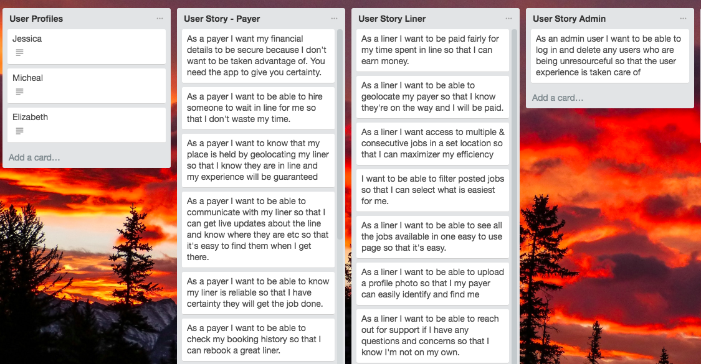
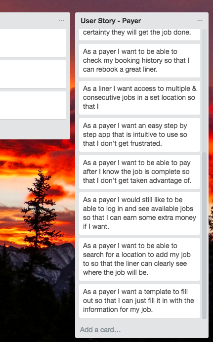

[Here](https://trello.com/b/XjgtW7yM/iddl-app)

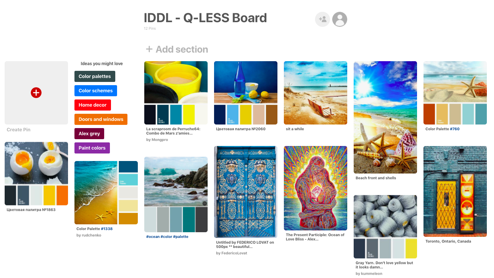

- Link to [Moonboard via Pinterest](https://www.pinterest.com.au/ajwhalley45/iddl-q-less-board/). Explain why these coulors corelate with the users 

- You can see the DB design here

- The messages and conversations tables were never used but I had planned for the future

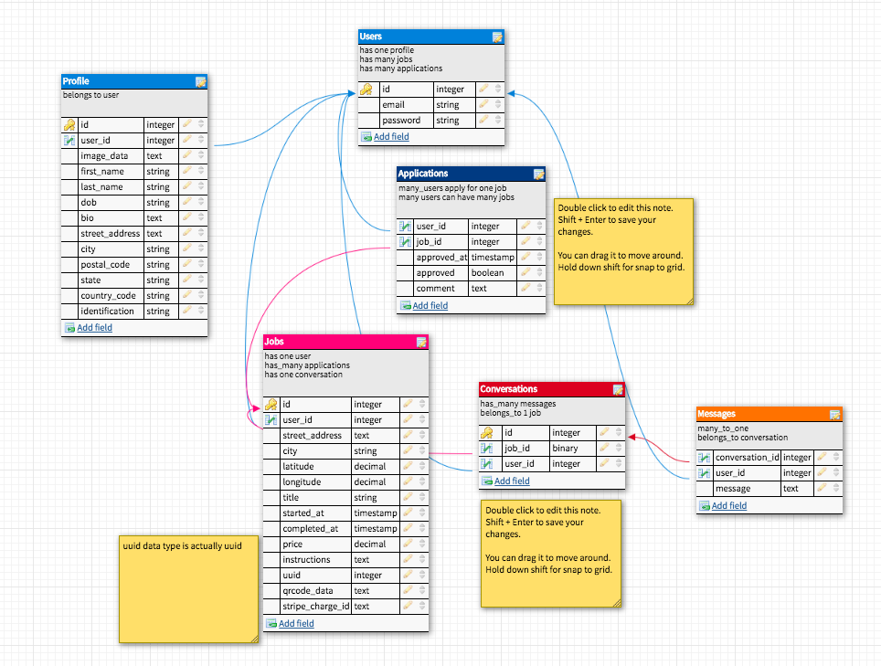

- Throughout the entire project I used Trello to manage where I was and what was next.

- 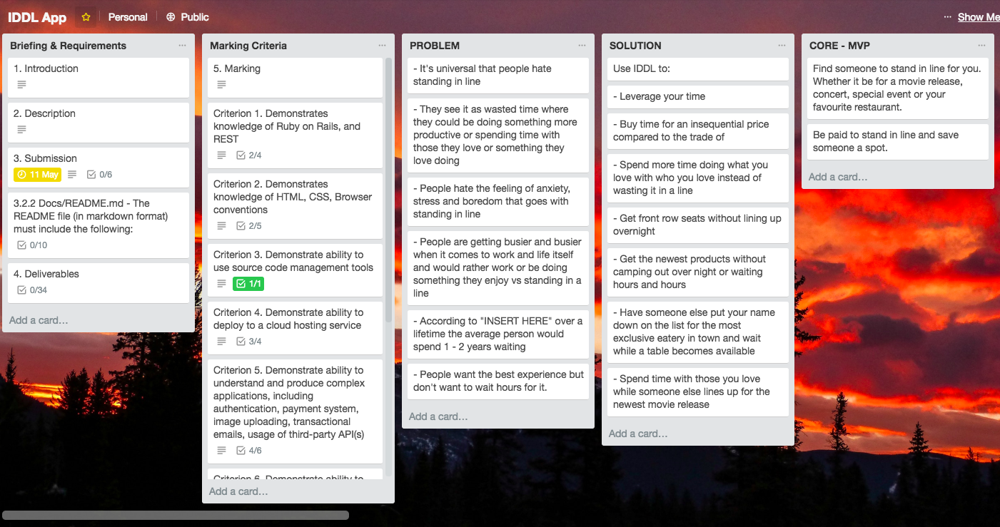

- 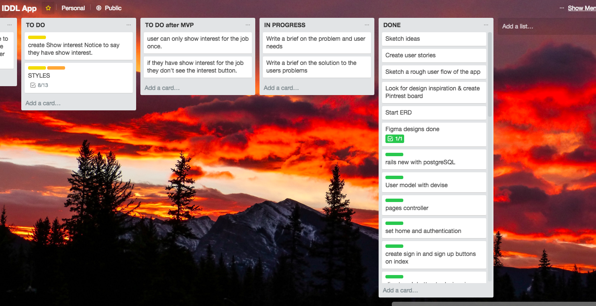

## Design
  - All things design was done with Figma
  - I also used it to visually see what I needed to do
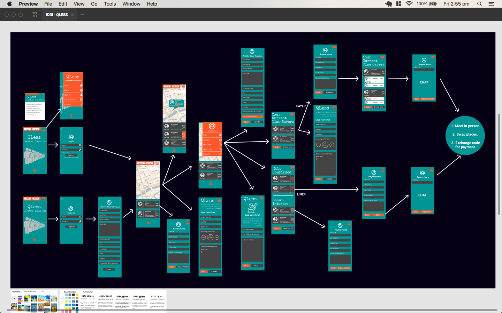
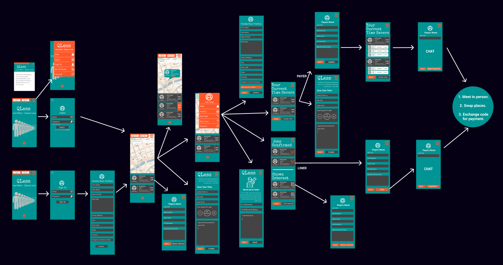
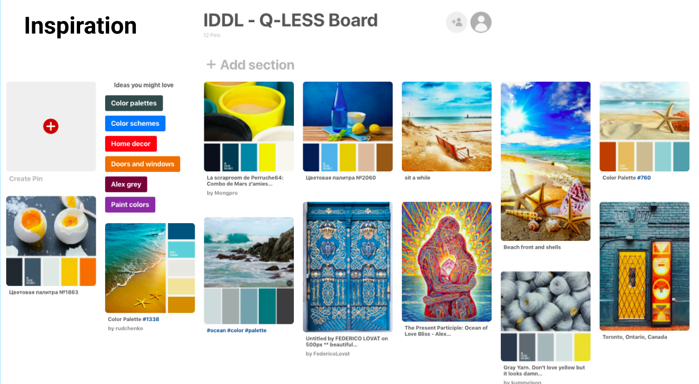
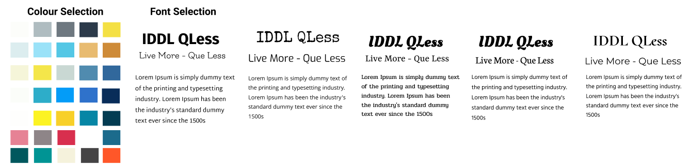
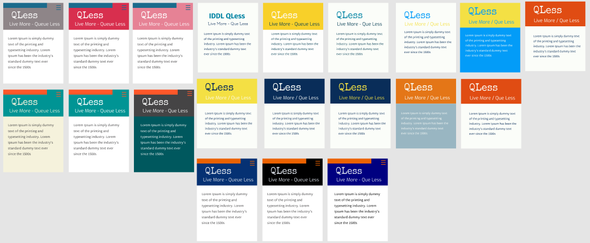
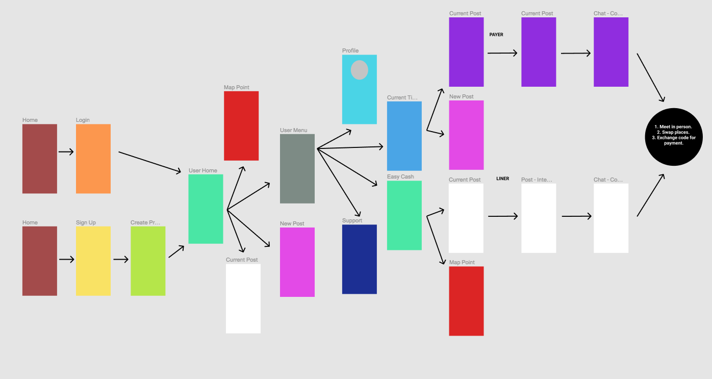

  - Programming 
    - I loved doing thris project and I learnt alot! 
    - One of the most challenges parts was having the jobs available to show interest and then confirmed by the job creater 

  - Future Development
     - For future development there is plenty of features and things to build apon
     - The first part will be a message ystem between the job creator and the user who has been confirmed for the job. 

### Gems 
 - Rspec-rails 
 - gem 'devise'
- gem 'geocoder'
- gem "pundit"
- gem 'mailgun_rails'
- gem "shrine", "~> 2.0"
- gem 'image_processing', '~> 1.2'
- gem 'stripe', '~> 3.13'
- gem 'simple_form'
- gem 'rubocop', '~> 0.55.0', require: false
- gem 'country_select', '~> 3.1', '>= 3.1.1'

